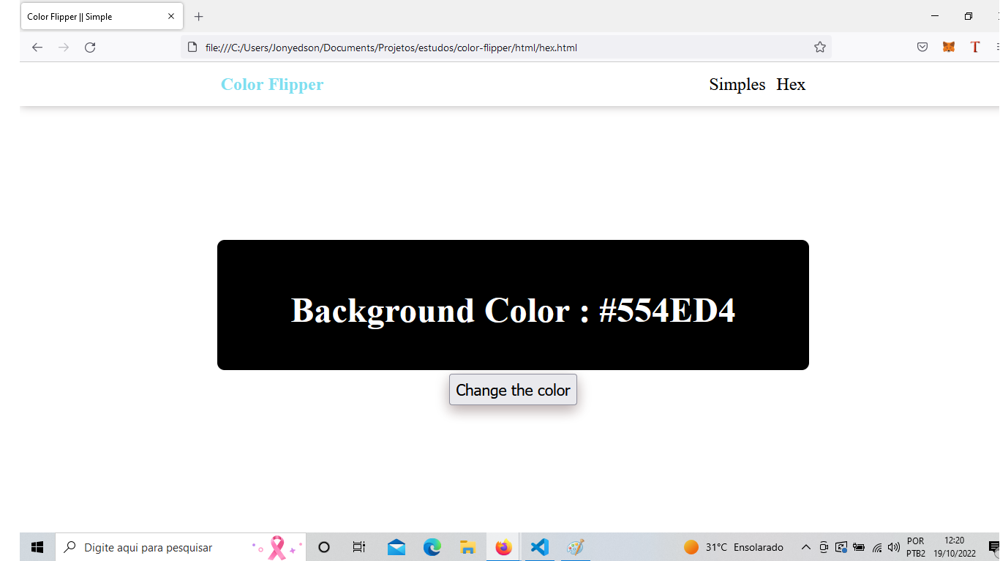
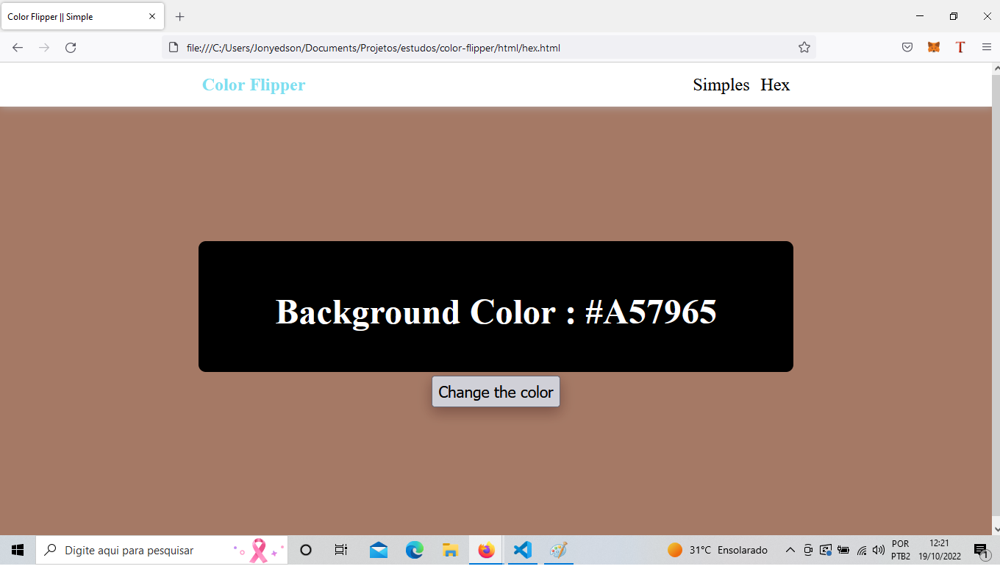

# color-flipper

Projeto simples para melhorar minha habilidade com html, css e javascript

### Esse projeto tem como objetivo apenas mudar a cor do body do html atreves de click em botão juntamente mostrando a cor selecionada em um display

#### Estado incial do projeto

  

#### A Cada click do botão a cor muda!

  

Fico muito feliz caso vocês tenham algum feedback sobre o projeto, estrutura, código ou qualquer outra coisa que você poder me reportar que me faça ser um desenvolvedor melhor.

#### Contato
  
  Email : cicerojonyedison@gmail.com
  
  Entre em contato com [Linkedin](https://www.linkedin.com/in/cicero-jonyedson-896088160/)